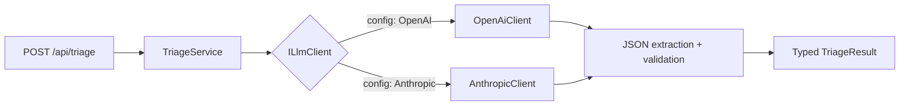
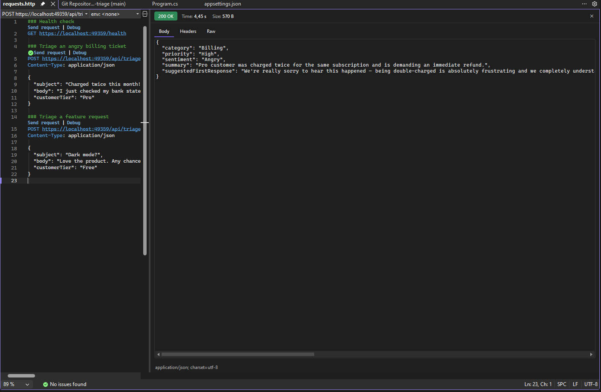

# LLM Ticket Triage — .NET 9 + OpenAI / Claude

[](https://github.com/bgulbol/dotnet-llm-ticket-triage/actions/workflows/ci.yml)


A production-style demo of **integrating LLMs into a .NET backend the right way**: a minimal API that takes a raw customer support ticket and returns a structured, validated triage decision — category, priority, sentiment, a one-line summary and a suggested first response.

The point of this repo is not the ticket use case itself. It's the **integration patterns** you need in any real LLM-powered .NET service:

- **Provider-agnostic LLM layer** — one `ILlmClient` interface, OpenAI and Anthropic (Claude) implementations. Switching providers is a config change, not a refactor.
- **Structured output you can trust** — the model is forced toward strict JSON, and the service layer defensively extracts and validates it into typed C# records. Markdown fences, stray prose, malformed JSON: all handled and tested.
- **Production plumbing** — exponential-backoff retries on 429/5xx, request timeouts, token usage logging on every call, clean 502s (never raw 500s) when the model misbehaves.
- **No SDK dependencies** — both providers are called with raw `HttpClient`, so you see exactly what goes over the wire and never fight SDK version churn.
- **Tested** — the triage logic is fully unit-tested against a fake LLM client; CI runs on every push.

## How it works



```
src/
  TicketTriage.Core/        # Domain: models, ILlmClient abstraction, prompts, triage logic
  TicketTriage.Providers/   # OpenAI + Anthropic HTTP clients, retry policy, DI registration
  TicketTriage.Api/         # .NET 9 minimal API
tests/
  TicketTriage.Tests/       # xUnit tests with a fake LLM client (no API key needed)
```

## Quick start

Requires the [.NET 9 SDK](https://dotnet.microsoft.com/download/dotnet/9.0).

```bash
git clone https://github.com/bgulbol/dotnet-llm-ticket-triage.git
cd dotnet-llm-ticket-triage

# Pick a provider and set its key
export OPENAI_API_KEY=sk-...        # default provider
# or: export ANTHROPIC_API_KEY=...  # and set Llm:Provider to "Anthropic" in appsettings.json

dotnet run --project src/TicketTriage.Api
```

Then send a ticket:

```bash
curl -X POST http://localhost:5000/api/triage \
  -H "Content-Type: application/json" \
  -d '{
    "subject": "Charged twice this month!!",
    "body": "I just checked my bank statement and you charged my card TWICE for the same subscription. I want a refund immediately.",
    "customerTier": "Pro"
  }'
```

Response:

```json
{
  "category": "Billing",
  "priority": "High",
  "sentiment": "Angry",
  "summary": "Customer was double-charged for their monthly subscription and is requesting a refund.",
  "suggestedFirstResponse": "I'm really sorry about the duplicate charge — I've flagged this to our billing team and we'll resolve it as a priority."
}
```

Live response during development (Claude Sonnet via the Anthropic provider):



More examples in [`samples/requests.http`](samples/requests.http). Run the tests (no API key required):

```bash
dotnet test
```

## Design decisions

**Why an interface instead of calling the provider directly?** Real projects outlive provider choices. Pricing changes, rate limits bite, a client asks for Azure OpenAI or Claude. `ILlmClient` keeps that decision out of the business logic — and makes the logic testable without network calls.

**Why raw HttpClient instead of the official SDKs?** For a service this size, the SDKs add version churn and abstraction without much value. Raw HTTP makes the integration transparent and keeps the dependency tree tiny. (In a larger product, an SDK can absolutely be the right call — this is a deliberate trade-off, not a rule.)

**Why defensive JSON extraction when the prompt already demands JSON?** Because models drift. Even with `response_format: json_object` on OpenAI and a strict system prompt, you will eventually get fenced output or a stray sentence. The service strips fences, extracts the outermost object, validates against typed records — and the failure mode is a logged, diagnosable `502`, not a midnight page.

**Why enums for category/priority/sentiment?** Downstream systems (routing, SLAs, dashboards) need a closed set of values. Deserializing into enums means an out-of-vocabulary answer fails loudly at the boundary instead of leaking garbage into the pipeline.

## Roadmap

- Streaming responses (SSE) for long-form outputs
- Batch triage endpoint with channel-based throttling
- Response caching for repeated/similar tickets
- Dockerfile + compose for one-command spin-up

## About

Built by [Burak Gulbol](https://www.linkedin.com/in/burakgulbol) — senior .NET engineer focused on integrating AI/LLMs into production systems. I'm currently co-founding [SolarDesk](https://github.com/bgulbol), a commercial .NET 9 desktop product that automates structural engineering for solar plants.

Licensed under [MIT](LICENSE).
